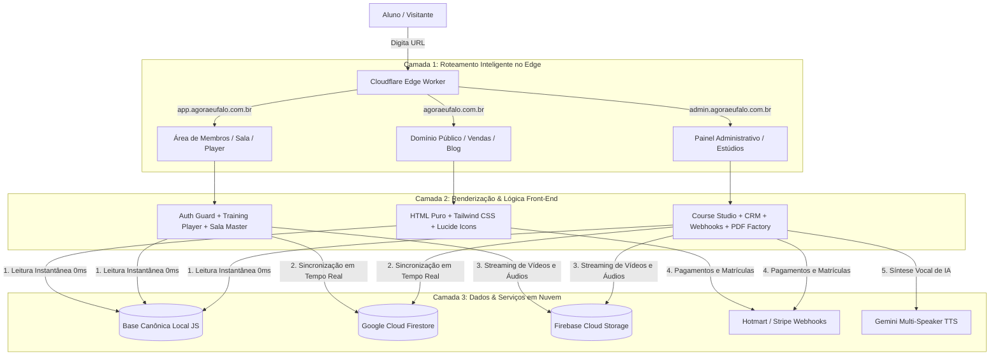

# 🏛️ MANUAL DE DESENVOLVIMENTO & BLUEPRINT ARQUITETÔNICO
**Ecossistema Digital & Plataforma SaaS EdTech — AgoraEuFalo**
*Professor Leonardo Leite & Antigravity AI Engineering Team*

---

## 📖 Apresentação & Propósito Deste Manual

Este documento é a **Cartilha Mestre de Arquitetura e Desenvolvimento** do ecossistema **AgoraEuFalo**. 

Ele foi escrito com dois objetivos complementares:
1. **Para o Professor Leonardo Leite (Aprendiz):** Explicar de forma didática, transparente e sem jargões desnecessários como cada peça da plataforma foi construída, por que ela existe e como todas as engrenagens se conectam.
2. **Para o Antigravity (Gerente de Desenvolvimento / AI Agent):** Servir como especificação técnica canônica e **Receita de Replicação** para manter a plataforma atualizada e construir novos projetos SaaS/EdTech com o mesmo nível de velocidade, estabilidade e elegância.

---

# 📑 ÍNDICE GERAL

1. [O Grande Mapa da Arquitetura (Filosofia Calm EdTech)](#1-o-grande-mapa-da-arquitetura-filosofia-calm-edtech)
2. [Roteamento Edge & Subdomínios Multi-Tenant (Cloudflare Workers)](#2-roteamento-edge--subdomínios-multi-tenant-cloudflare-workers)
3. [Arquitetura Híbrida de Dados: Single Source of Truth (Registry + Firestore)](#3-arquitetura-híbrida-de-dados-single-source-of-truth)
4. [Sistema de Autenticação, Tiers & Guardas de Rota](#4-sistema-de-autenticação-tiers--guardas-de-rota)
5. [Motor de Áudio & Training Player (Gemini TTS + Timestamps Milimétricos)](#5-motor-de-áudio--training-player)
6. [PDF Factory & Fábrica Editorial Diagramada (ReportLab + Calm Design 40+)](#6-pdf-factory--fábrica-editorial-diagramada)
7. [Esteira de Testes Automatizados Headless & CI/CD](#7-esteira-de-testes-automatizados-headless--cicd)
8. [Casos Reais de Troubleshooting & Lições de Engenharia](#8-casos-reais-de-troubleshooting--lições-de-engenharia)
9. [Guia de Replicação com Antigravity (Blueprint para Novos Projetos)](#9-guia-de-replicação-com-antigravity)

---

# 1. O Grande Mapa da Arquitetura (Filosofia Calm EdTech)

A plataforma AgoraEuFalo não utiliza servidores monolíticos pesados (como Node/Express ou Django rodando em containers lentos) e nem SPAs (Single Page Applications) monolíticas em React/Next.js inchadas com megabytes de JavaScript desnecessário.

Adotamos a arquitetura **Edge-Serverless Jamstack + Headless Micro-Frontends**:
- **Velocidade Extrema (0ms de latência percebida):** As páginas HTML e assets estáticos são entregues instantaneamente pelos 300+ datacenters da Cloudflare espalhados pelo mundo.
- **Calm EdTech & Tipografia 40+:** Design acolhedor, limpo, de alto contraste (Deep Navy `#0A192F`, Ocre `#C68A36`, Branco puro e papel `#FAF8F5`), com fontes generosas (15pt a 17pt) para leitura relaxada de alunos adultos.
- **Independência Total:** Se o banco de dados online cair ou oscilar, o aluno continua estudando perfeitamente porque o acervo canônico local (`aef-courses-registry.js`) entra em ação imediatamente.

### 🌐 Diagrama da Topologia do Ecossistema



---

# 2. Roteamento Edge & Subdomínios Multi-Tenant (Cloudflare Workers)

### 💡 O Conceito (Por que existe?)
Um dos maiores pontos de atrito no desenvolvimento web tradicional é o roteamento feio e frágil (ex: `site.com/sala-de-aula.html?curso=123`).
O aluno e o administrador devem navegar por **URLs limpas e elegantes no padrão RESTful** (`/`, `/sala`, `/player`, `/cursos`, `/alunos`), sem que a extensão `.html` fique exposta na barra de endereço.

Além disso, temos **3 subdomínios distintos** que compartilham o mesmo repositório de arquivos:
1. `agoraeufalo.com.br` (Site institucional, blog, vendas).
2. `app.agoraeufalo.com.br` (Área de membros e alunos).
3. `admin.agoraeufalo.com.br` (Painel administrativo e estúdios).

### ⚙️ A Mecânica do Worker (`_worker.js`)
O Cloudflare Worker intercepta a requisição antes mesmo de ela tocar qualquer arquivo físico no disco. Ele analisa o **Hostname** (o domínio digitado) e o **Pathname** (o caminho após a barra) e faz o mapeamento transparente.

```javascript
// Trecho do _worker.js
export default {
  async fetch(request, env) {
    const url = new URL(request.url);
    const host = url.hostname.toLowerCase();
    const pathname = url.pathname;

    // Se for asset estático (CSS, JS, Imagens, Fontes), serve direto do cache
    if (pathname.startsWith('/assets/') || pathname.startsWith('/Material-PDF/')) {
      return env.ASSETS.fetch(request);
    }

    // 1. SUBDOMÍNIO ADMIN (admin.agoraeufalo.com.br)
    if (host.startsWith('admin.')) {
      if (pathname === '/' || pathname === '') return env.ASSETS.fetch(new Request(new URL('/admin.html', url), request));
      if (pathname === '/cursos') return env.ASSETS.fetch(new Request(new URL('/admin-cursos.html', url), request));
      if (pathname === '/alunos') return env.ASSETS.fetch(new Request(new URL('/admin-alunos.html', url), request));
      if (pathname === '/vendas') return env.ASSETS.fetch(new Request(new URL('/admin-vendas.html', url), request));
      if (pathname === '/webhooks') return env.ASSETS.fetch(new Request(new URL('/admin-webhooks.html', url), request));
      if (pathname === '/marketing') return env.ASSETS.fetch(new Request(new URL('/admin-marketing.html', url), request));
      if (pathname === '/pdf-factory') return env.ASSETS.fetch(new Request(new URL('/admin-pdf-factory.html', url), request));
      if (pathname === '/tts') return env.ASSETS.fetch(new Request(new URL('/tts-studio.html', url), request));
      if (pathname === '/blog') return env.ASSETS.fetch(new Request(new URL('/blog-panel.html', url), request));
      if (pathname === '/seo') return env.ASSETS.fetch(new Request(new URL('/seo-manager.html', url), request));
    }

    // 2. SUBDOMÍNIO APP (app.agoraeufalo.com.br)
    if (host.startsWith('app.')) {
      if (pathname === '/' || pathname === '') return env.ASSETS.fetch(new Request(new URL('/portal.html', url), request));
      if (pathname === '/sala') return env.ASSETS.fetch(new Request(new URL('/sala-de-aula.html', url), request));
      if (pathname === '/curso') return env.ASSETS.fetch(new Request(new URL('/curso.html', url), request));
      if (pathname === '/player') return env.ASSETS.fetch(new Request(new URL('/treino/player.html', url), request));
      if (pathname === '/login') return env.ASSETS.fetch(new Request(new URL('/login.html', url), request));
      if (pathname === '/cadastro') return env.ASSETS.fetch(new Request(new URL('/cadastro.html', url), request));
    }

    // 3. DOMÍNIO PÚBLICO (agoraeufalo.com.br)
    if (pathname === '/' || pathname === '') return env.ASSETS.fetch(new Request(new URL('/index.html', url), request));
    if (pathname === '/projeto-aef') return env.ASSETS.fetch(new Request(new URL('/projeto-aef.html', url), request));
    if (pathname === '/precos') return env.ASSETS.fetch(new Request(new URL('/precos.html', url), request));

    // Fallback padrão
    return env.ASSETS.fetch(request);
  }
};
```

---

# 3. Arquitetura Híbrida de Dados: Single Source of Truth

### 💡 O Conceito (Por que existe?)
Em aplicações tradicionais, a tela fica travada exibindo uma mensagem de *"Carregando..."* enquanto busca dados no banco em nuvem. Se o aluno estiver no 4G com sinal instável, a experiência é frustrante.

Nossa solução é a **Arquitetura Híbrida de 2 Camadas**:
1. **Camada Local Imediata (`assets/js/aef-courses-registry.js`):** Um arquivo JavaScript leve que contém todo o catálogo canônico de cursos, módulos, aulas, URLs de vídeo/áudio e sacadas de ouro. É carregado junto com o HTML em **0 milissegundos**.
2. **Camada em Nuvem em Tempo Real (`assets/js/aef-cloud-sync.js`):** Conecta ao **Google Cloud Firestore** em segundo plano. Se você criar uma aula nova ou alterar um título no Course Studio, o Firestore envia a alteração e atualiza a tela na hora, sem que o aluno precise dar F5.

### 📦 Estrutura do Schema Canônico (Course > Module > Lesson)

Toda aula no ecossistema segue rigorosamente este contrato de dados (1:1 com o schema do Firestore):

```javascript
{
  "id": "aula-1788736026295",
  "title": "HORAS - Como Dizer as Horas em Inglês",
  "order": 1,
  "duration": "05:12",
  "courseId": "dtc_curso",
  "moduleId": "ciclo-02",
  "videoUrl": "https://firebasestorage.googleapis.com/.../video.mp4",
  "audioUrl": "https://firebasestorage.googleapis.com/.../audio.mp3",
  "thumbnailUrl": "assets/images/thumbs/dtc_intro_thumb.jpg",
  "pdfUrl": "Material-PDF/DTC_1_1_Horas_em_Ingles.pdf",
  "goldenTip": "Em inglês, primeiro você fala os minutos passados ou que faltam. Ex: 'quarter past five'.",
  "processedContentHtml": "<div class='space-y-4'>...</div>",
  "hasTrainingTrack": true,
  "trainingTrackId": "dtc-horas-track",
  "published": true
}
```

---

# 4. Sistema de Autenticação, Tiers & Guardas de Rota

### 💡 O Conceito & Matriz de Tiers
A plataforma possui 4 níveis de acesso perfeitamente delimitados no Firestore e no LocalStorage:

| Tier | Nome | Acesso Liberado |
|---|---|---|
| **🌱 Tier 1** | `free` (Lead / Grátis) | Sugestões do Leo, 1º módulo degustação de cursos, 1 treino customizado no Player. |
| **🎓 Tier 2** | `club_member` (Membro Club) | Acesso irrestrito a todos os cursos matriculados, treinos ilimitados no Player e apostilas PDF. |
| **👑 Tier 3** | `vip_mentor` (Mentoria VIP) | Tudo do Club + Aba exclusiva com prescrições 1 a 1 do Professor Leo e link direto do Google Meet. |
| **⚡ Standalone**| `standalone` (Venda Avulsa) | Acesso vitalício exclusivamente ao curso comprado avulso. |

### 🛡️ O Guardião de Rota com Resolução Instantânea (0ms)
No arquivo [`assets/js/aef-portal-auth.js`](file:///Users/macbookpro/Desktop/agoraeufalo_site/assets/js/aef-portal-auth.js), a função `requireAuth()` protege as páginas restritas (`/sala`, `/player`, `/admin`).

```mermaid
flowchart TD
    Start[Aluno acessa /sala ou /player] --> CheckLocal{Há sessão ativa no localStorage?}
    CheckLocal -->|Sim| AllowInstant[✅ Libera tela IMEDIATAMENTE (0ms)]
    CheckLocal -->|Não| CheckEnv{Ambiente Local/Dev?}
    CheckEnv -->|Sim| DevLogin[Simula login Master Leo]
    CheckEnv -->|Não| CheckFirebase{Firebase Auth tem usuário logado?}
    CheckFirebase -->|Sim| SyncLocal[Salva sessão no localStorage e libera]
    CheckFirebase -->|Não após timeout| RedirectLogin[🔒 Redireciona para /login]
```

---

# 5. Motor de Áudio & Training Player

### 💡 O Conceito (A Mecânica da Fala Espontânea)
O **Training Player** ([`treino/player.html`](file:///Users/macbookpro/Desktop/agoraeufalo_site/treino/player.html)) é o coração do método de escuta repetida. Ele não é um player de música comum; é um instrumento de musculação vocal.

### 🎛️ Os 4 Pilares Técnicos do Player:
1. **Áudio MP3 Puro (128 kbps LAME):** Garantia de busca (*seek*) milissegundo a milissegundo sem atraso em conexões móveis.
2. **Timestamps Frase a Frase (`sentences`):** Cada sentença possui tempo de início (`start`) e fim (`end`) em segundos com até 3 casas decimais.
3. **Auto-Scroll da Letra com Destaque Ativo:** Conforme o áudio avança, a linha correspondente ganha destaque âmbar na tela e rola suavemente para o centro visual.
4. **Repetição Contínua em Loop (`🔂`):** O aluno clica no botão de loop em uma frase contraintuitiva. O player trava a reprodução exclusivamente entre `sentence.start` e `sentence.end` indefinidamente, até a pronúncia virar reflexo!

```javascript
// Exemplo de estrutura de faixa do Player
{
  "id": "dtc-01-horas",
  "title": "Horas em Inglês • Treino Auditivo",
  "audioUrl": "https://.../dtc_horas.mp3",
  "duration": 78.5,
  "sentences": [
    {
      "start": 0.0,
      "end": 3.8,
      "speaker": "Leo",
      "text": "Hello, my dear friend! What time is it now?",
      "spokenTranslation": "Hello, my dear friend! Que horas são agora?"
    },
    {
      "start": 3.9,
      "end": 7.2,
      "speaker": "Student",
      "text": "It is a quarter to five in the afternoon.",
      "spokenTranslation": "São quinze pras cinco da tarde."
    }
  ]
}
```

---

# 6. PDF Factory & Fábrica Editorial Diagramada

### 💡 O Conceito
Para o aluno adulto (40+), o material impresso ou baixado em PDF no tablet é sagrado.
O ecossistema possui a **PDF Factory** ([`admin-pdf-factory.html`](file:///Users/macbookpro/Desktop/agoraeufalo_site/admin-pdf-factory.html) e scripts Python em ReportLab) que compila automaticamente qualquer aula em apostilas A4 luxuosas.

### 📐 Os 3 Grandes Arquétipos Visuais:
1. **Arquétipo 1 — Capa Nobre (Deep Navy `#0A192F`):** Título generoso, ficha técnica, arte oficial 1:1 e sinopse pedagógica.
2. **Arquétipo 2 — Texto & Vocabulário Vivo (Calm Canvas `#FAF8F5`):** Texto didático principal com fonte de **15pt a 17pt**, entrelinha confortável (leading 22pt), matriz de sound chunks e pílulas do "Sentimento da Estrutura".
3. **Arquétipo 3 — Workbook Prático:** Seção de *Listen & Answer* com linhas pautadas para escrita manual (**sem respostas impressas**), desafio de *Listen & Ask* (**sem perguntas impressas**) e a *Sacada de Ouro do Leo* em destaque monumental.

---

# 7. Esteira de Testes Automatizados Headless & CI/CD

### 💡 O Conceito (Como garantir que NADA quebre?)
Em vez de testar manualmente 21 telas a cada mudança, criamos um robô de testes headless em Node.js com **JSDOM** ([`scripts/test_all_ecosystem_pages.js`](file:///Users/macbookpro/Desktop/agoraeufalo_site/scripts/test_all_ecosystem_pages.js)).

Em **menos de 15 segundos**, ele:
1. Carrega todas as 21 páginas dos domínios `app`, `admin` e `público`.
2. Injeta o ambiente de produção, credenciais e banco de dados local.
3. Dispara o evento `DOMContentLoaded` e executa todos os scripts.
4. Clica e valida se acordeões, títulos, formulários, players e grades de aulas renderizaram com 100% de precisão.
5. Gera o relatório canônico `test_report.json`.

```bash
# Execução da esteira de testes completa
node scripts/test_all_ecosystem_pages.js

# Build de produção (sincroniza HTML, CSS, JS e imagens para /dist)
npm run build

# Publicação instantânea no Cloudflare Edge
npx wrangler deploy
```

---

# 8. Casos Reais de Troubleshooting & Lições de Engenharia

Esta seção registra os bugs reais que enfrentamos e como os solucionamos, para que o aprendizado nunca se perca:

### 🐛 Caso 1: A Grade da Sala de Aula travada em "Carregando aulas..."
- **Sintoma:** Ao entrar na sala de aula, a barra lateral direita ficava congelada em *"GRADE DO CURSO - Carregando aulas..."*.
- **Causa Raiz:** O código chamava `window.aefPortalAuth.getUserTier()`. Essa função não existia na classe de autenticação (o nome original era `getActiveTier()`), disparando um `TypeError` não tratado que abortava o script antes da chamada de `renderCourseSyllabus()`.
- **Solução:** Criamos aliases retrocompatíveis (`getUserTier()` e `getTier()`) na classe `AEFPortalAuth` e normalizamos o método no HTML.

### 🐛 Caso 2: Atraso de 2 segundos na renderização por espera do Firebase
- **Sintoma:** As páginas demoravam 2 segundos para mostrar o conteúdo do aluno.
- **Causa Raiz:** O guardião `requireAuth()` executava `await this.auth.onAuthStateChanged(...)` com um `setTimeout` de 2000ms antes de olhar para o `localStorage`.
- **Solução:** Invertemos a ordem de checagem. Se já existir uma sessão gravada no `localStorage`, a função retorna `true` imediatamente em **0 milissegundos**, buscando o Firebase em segundo plano sem bloquear a tela do usuário.

### 🐛 Caso 3: Incompatibilidade de `innerText` no ambiente de teste Headless (JSDOM)
- **Sintoma:** O teste automatizado acusava que o título do curso não havia mudado, embora no navegador estivesse funcionando.
- **Causa Raiz:** A biblioteca JSDOM não possui motor gráfico de layout completo, tornando a atribuição `element.innerText = '...'` ineficaz em certos nós virtuais.
- **Solução:** Padronizamos o código para utilizar `element.textContent = '...'`, que é o padrão W3C universal, muito mais rápido e 100% compatível com navegadores e ambientes de teste automatizado.

---

# 9. Guia de Replicação com Antigravity

Quando você quiser criar um novo projeto SaaS, curso digital ou plataforma de membros do zero, forneça o seguinte **Prompt Blueprint** ao Antigravity:

> ### 📋 Prompt Mestre de Replicação:
> *"Antigravity, atue como Engineering Manager e crie um novo ecossistema SaaS EdTech baseado no padrão canônico do AgoraEuFalo ([`MANUAL_DESENVOLVIMENTO_BLUEPRINT.md`](file:///Users/macbookpro/Desktop/agoraeufalo_site/MANUAL_DESENVOLVIMENTO_BLUEPRINT.md)).*
> *Requisitos Obrigatórios:*
> *1. Roteamento Edge no Cloudflare Workers (`_worker.js`) com rotas limpas RESTful nos subdomínios `app`, `admin` e `public`.*
> *2. Arquitetura Híbrida com catálogo canônico em `registry.js` (0ms FCP) e sincronização Firestore em segundo plano.*
> *3. Autenticação instantânea via LocalStorage com fallback de nuvem e matriz de Tiers (Free, Club, VIP).*
> *4. Design System Calm EdTech com Tailwind CSS, fontes 15-17pt para conforto visual e alto contraste.*
> *5. Suíte de testes headless com JSDOM validando 100% das telas antes de cada deploy."*

---

**Fim do Documento 1 • AgoraEuFalo Engineering Standards**
