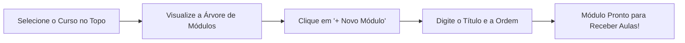
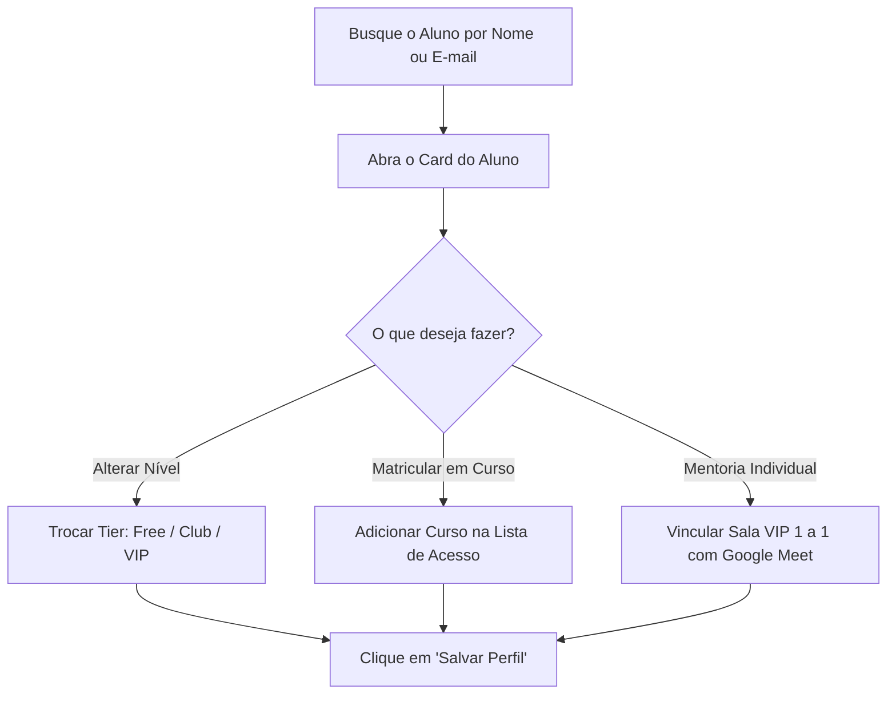

# 🏛️ MANUAL DO USUÁRIO ADMIN & GUIA OPERACIONAL
**Painel Administrativo & Gestão do Ecossistema — AgoraEuFalo**
*Professor Leonardo Leite & Equipe*

---

## 🌟 Seja Muito Bem-Vindo ao Seu Centro de Comando!

Este manual foi escrito especialmente para você, **Professor Leo**, e para qualquer membro da sua equipe que for operar a plataforma no dia a dia.

Aqui você não precisa entender de programação nem de linhas de comando. Este guia foi desenhado em formato de **Jornadas Práticas Passo a Passo**, mostrando onde clicar, o que preencher e como utilizar cada um dos 10 superpoderes do seu painel administrativo em `admin.agoraeufalo.com.br`.

---

# 📑 ÍNDICE DE JORNADAS OPERACIONAIS

1. [O Hub Central do Admin (`admin.html`)](#1-o-hub-central-do-admin)
2. [Jornada 1: Criando e Gerenciando Cursos e Módulos (Course Studio)](#2-jornada-1-criando-e-gerenciando-cursos-e-módulos)
3. [Jornada 2: Cadastrando uma Aula Completa (A Matriz dos 5 Elementos)](#3-jornada-2-cadastrando-uma-aula-completa)
4. [Jornada 3: Sintetizando Áudios de Alta Fidelidade no Gemini TTS Studio](#4-jornada-3-sintetizando-áudios-no-gemini-tts-studio)
5. [Jornada 4: Gerando Apostilas Diagramadas em PDF (PDF Factory)](#5-jornada-4-gerando-apostilas-diagramadas-em-pdf)
6. [Jornada 5: Gestão de Alunos, Matrículas e Mentoria VIP (CRM Alunos)](#6-jornada-5-gestão-de-alunos-matrículas-e-mentoria-vip)
7. [Jornada 6: Gerenciando Vendas, Checkouts e Webhooks (Hotmart & Stripe)](#7-jornada-6-gerenciando-vendas-checkouts-e-webhooks)
8. [Jornada 7: Criando Banners & Blocos de Marketing (Block Engine)](#8-jornada-7-criando-banners--blocos-de-marketing)
9. [Jornada 8: Publicando Artigos no Blog e Otimizando SEO](#9-jornada-8-publicando-artigos-no-blog-e-otimizando-seo)
10. [Guia de Primeiros Socorros & Dicas de Uso no Celular](#10-guia-de-primeiros-socorros--dicas-de-uso-no-celular)

---

# 1. O Hub Central do Admin

Ao acessar **`admin.agoraeufalo.com.br`** (ou `admin.html`), você é recebido pelo seu painel central unificado com acesso direto aos 10 estúdios:

```
┌────────────────────────────────────────────────────────────────────────┐
│                        AGORAEUFALO ADMIN MASTER                        │
├────────────────────────────────────────────────────────────────────────┤
│ 1. 🎓 Course Studio      ➔ Criação e edição da grade de cursos e aulas │
│ 2. 👥 CRM de Alunos       ➔ Gestão de alunos, tiers e mentoria VIP     │
│ 3. 💳 Vendas & Checkouts  ➔ Links de checkout Hotmart e Stripe         │
│ 4. ⚡ Webhooks Monitor    ➔ Simulador e auditoria de compras em tempo  │
│ 5. 🎨 Marketing Engine    ➔ Banners, caixas didáticas e CTAs           │
│ 6. 📄 PDF Factory         ➔ Fábrica de apostilas A4 luxuosas           │
│ 7. 🎙️ Gemini TTS Studio   ➔ Gravação de áudios com vozes de IA         │
│ 8. ✍️ Blog CMS Panel      ➔ Redação e publicação de artigos longos     │
│ 9. 🔍 SEO Manager         ➔ Indexação no Google e meta tags OpenGraph  │
│ 10. 🚪 Ver Como Aluno     ➔ Atalho para entrar na sala como estudante  │
└────────────────────────────────────────────────────────────────────────┘
```

---

# 2. Jornada 1: Criando e Gerenciando Cursos e Módulos

**Painel:** `admin-cursos.html` (Acesso rápido: `/cursos`)



### 🚀 Passo a Passo:
1. **Selecionar Curso:** No menu superior do Course Studio, selecione o curso que deseja editar (ex: *Dates and Times*, *Magic Stories Legacy*, *Mentoria André*).
2. **Criar Novo Módulo:** Na coluna esquerda (Árvore de Conteúdo), clique no botão **`+ Novo Módulo`**.
3. **Preencher Ficha do Módulo:**
   - **Título do Módulo:** Ex: `CICLO 02 • As Horas em Inglês`.
   - **Ordem de Exibição:** `1`, `2`, `3`...
   - **Degustação Grátis (🌱 Free Tier):** Marque esta opção se este módulo for aberto para leads e visitantes gratuitos experimentarem o método.
4. **Salvar:** Clique em **`Salvar Alterações`**.

---

# 3. Jornada 2: Cadastrando uma Aula Completa

**Painel:** `admin-cursos.html` ➔ Selecione a aula no menu esquerdo.

Toda Masterclass no ecossistema AgoraEuFalo opera sobre a **Matriz dos 5 Elementos Canônicos**:

```
┌────────────────────────────────────────────────────────────────────────┐
│               A MATRIZ DOS 5 ELEMENTOS DA MASTERCLASS                  │
├────────────────────────────────────────────────────────────────────────┤
│ 🎬 1. Vídeo Masterclass (.MP4 ou YouTube)                              │
│ 📄 2. Apostila Diagramada (.PDF)                                       │
│ 🖼️ 3. Miniatura 16:9 & Capa 1:1 Oficial                                │
│ 💡 4. Sacada de Ouro do Professor Leo                                  │
│ 📝 5. Área Didática de Texto / HTML Formatado (processedContentHtml)   │
└────────────────────────────────────────────────────────────────────────┘
```

### 🚀 Passo a Passo de Preenchimento:
1. **Título da Aula:** Digite um título claro e direto (ex: `HORAS - Como Dizer as Horas em Inglês`).
2. **Duração:** Ex: `05:12`.
3. **Vídeo (.MP4 ou YouTube):** Cole a URL do vídeo armazenado no Firebase Storage ou o link direto do YouTube.
4. **Áudio (.MP3):** Cole a URL do áudio MP3 128k correspondente.
5. **Miniatura 16:9 (`thumbnailUrl`):** Insira a imagem de capa da aula (ex: `assets/images/thumbs/dtc_intro_thumb.jpg`).
6. **Apostila PDF (`pdfUrl`):** Insira o caminho do PDF oficial (ex: `Material-PDF/DTC_1_1_Horas_em_Ingles.pdf`).
7. **💡 Sacada de Ouro do Leo:** Digite o insight mestre que o aluno não pode esquecer (ex: *"Em inglês, você sempre diz o que já passou ou o que falta para a hora seguinte. Ex: a quarter past five."*).
8. **📝 Área Didática de Texto (`processedContentHtml`):** Digite ou cole o roteiro formatado, tabelas de sons e vocabulário com fundos claros (`bg-amber-50`).
9. **📌 Botão 'Enviar para o Player':** Marque a caixa `Vincular ao Training Player` e informe o ID da faixa auditiva.
10. **Publicar:** Clique no botão verde **`Salvar e Publicar Aula`**. A alteração entra no ar imediatamente!

---

# 4. Jornada 3: Sintetizando Áudios no Gemini TTS Studio

**Painel:** `tts-studio.html` (Acesso rápido: `/tts`)

Quando você não tiver tempo de gravar uma explicação ou diálogo em estúdio com microfone, utilize o **Gemini Multi-Speaker TTS** com fidelidade humana de 128 kbps.

### 🚀 Como Criar Áudios com 2 Vozes (Dual Speaker):
1. **Título do Áudio:** Digite o nome da faixa (ex: `DTC 01 • Grazi Diálogo de Horas`).
2. **Caixa de Roteiro:** Digite a conversa no formato de locutores:
   ```text
   Rodrigo: Hello, my dear friend! What time is the meeting?
   Liam: It is at a quarter to three in the afternoon!
   Rodrigo: Perfect, see you there!
   ```
3. **Seleção de Vozes:**
   - Locutor 1: `Rodrigo` (Voz: *Aoede*)
   - Locutor 2: `Liam` (Voz: *Puck*)
4. **Gerar Áudio:** Clique em **`Gerar Áudio com IA`**.
5. **Ouvir & Baixar:** Dê play para conferir a naturalidade e clique em **`Baixar MP3 (128 kbps)`** para vincular à sua aula.

---

# 5. Jornada 4: Gerando Apostilas Diagramadas em PDF

**Painel:** `admin-pdf-factory.html` (Acesso rápido: `/pdf-factory`)

A **PDF Factory** transforma o conteúdo de qualquer aula em uma apostila de luxo com tipografia relaxada de **15pt a 17pt** para conforto visual de adultos e idosos.

### 🚀 Passo a Passo:
1. **Importar Dados da Aula:** Selecione o curso e a aula desejada no seletor do topo.
2. **Preview Visual:** O canvas central carrega automaticamente:
   - Capa Deep Navy institucional.
   - Texto de Listen & Read sem poluição visual.
   - Matriz de Sound Chunks e Deep Dive sem jargões gramaticais.
   - Workbook com linhas pautadas para escrita manual.
   - Sacada de Ouro em destaque monumental âmbar.
3. **Ajuste Fino:** Se desejar editar qualquer parágrafo antes de gerar o PDF, faça o ajuste diretamente nas caixas de texto.
4. **Gerar PDF Oficial:** Clique no botão azul **`Compilar Apostila A4 em PDF`**. O arquivo é baixado instantaneamente no seu computador e salvo na pasta `Material-PDF/`.

---

# 6. Jornada 5: Gestão de Alunos, Matrículas e Mentoria VIP

**Painel:** `admin-alunos.html` (Acesso rápido: `/alunos`)



### 💡 Gerenciando um Aluno de Mentoria VIP Individual:
1. Localize o aluno pelo campo de busca (ex: `André`).
2. Mude o Tier para **`👑 Mentoria VIP Individual`**.
3. No campo **Link do Google Meet**, cole o link da sala fixa de vocês (ex: `https://meet.google.com/kvu-upgw-osv`).
4. Clique em **`Salvar`**.
5. *Resultado:* Quando o André entrar no portal dele, ele verá o card dourado de Mentoria VIP com botão de entrada direta no Google Meet e seu curso personalizado!

---

# 7. Jornada 6: Gerenciando Vendas, Checkouts e Webhooks

**Painéis:** `admin-vendas.html` (`/vendas`) & `admin-webhooks.html` (`/webhooks`)

### 🛒 A Regra de Ouro dos Checkouts:
- **Hotmart (Primário):** Processa assinaturas em Reais (BRL), PIX, boleto e cartão em até 12x.
- **Stripe (Fallback Global):** Processa vendas internacionais em Dólar (USD) e Euro (EUR).

### ⚡ Como Testar se uma Venda Está Liberando o Acesso Automaticamente:
1. Acesse o **Simulador de Webhooks** em `admin-webhooks.html`.
2. No menu suspenso, escolha o evento: `Hotmart: Assinatura Aprovada (PURCHASE_APPROVED)`.
3. Digite um e-mail de teste (ex: `aluno.teste@gmail.com`) e o produto `AgoraEuFalo Club`.
4. Clique em **`Disparar Simulação de Webhook`**.
5. O sistema processará a notificação e liberará a matrícula do aluno no Firestore em menos de 1 segundo!

---

# 8. Jornada 7: Criando Banners & Blocos de Marketing

**Painel:** `admin-marketing.html` (Acesso rápido: `/marketing`)

O **Marketing Block Engine** permite criar caixas de destaque, avisos de matrículas e caixas de dúvidas do Leo para espalhar pelo site sem precisar mexer em código.

### 🚀 Como Criar um Bloco de Conversão:
1. Clique em **`+ Criar Novo Bloco`**.
2. Defina a Tag / Identificador (ex: `banner-matriculas-2026`).
3. Escolha o Estilo Visual:
   - *Deep Navy Nobre* (Fundo escuro e botões dourados).
   - *Calm Amber* (Fundo claro amadeirado de alto contraste).
4. Digite a chamada e o link do checkout da Hotmart.
5. Clique em **`Salvar Bloco`**. Ele já estará disponível para ser inserido em qualquer artigo do blog ou lição.

---

# 9. Jornada 8: Publicando Artigos no Blog e Otimizando SEO

**Painéis:** `blog-panel.html` (`/blog`) & `seo-manager.html` (`/seo`)

Toda publicação de artigo no blog segue a regra institucional de **+5.000 caracteres**, caixas didáticas claras e proteção de SEO.

### 🚀 As 4 Etapas de Publicação do Artigo:
1. **Redação no Blog Panel:** Digite o título, sinopse, capa 16:9 e cole o texto formatado no editor.
2. **Componentes Obrigatórios:** Certifique-se de incluir a caixa de dúvidas do Leo (`#duvidas-box`) e o card do Projeto 2026 (`#projeto-2026`).
3. **Gerar PDF do Post:** Clique em **`Gerar Versão em PDF para Download`**.
4. **Auditoria de SEO:** Abra o `seo-manager.html`, confira se a meta tag de compartilhamento no WhatsApp/Google está com a imagem correta e clique em **`Sincronizar Sitemap.xml`**.

---

# 10. Guia de Primeiros Socorros & Dicas de Uso no Celular

### ❓ "Fiz uma alteração em uma aula mas o aluno diz que não atualizou no celular dele. O que fazer?"
1. **Cache do Navegador:** O navegador do aluno pode ter guardado a página antiga na memória. Peça para ele fechar a aba e reabrir, ou dar um toque no botão de recarregar.
2. **Validação no Admin:** Entre em `admin-cursos.html`, selecione a aula e confirme se o status está como **`Publicada`** (verde) e não **`Rascunho`** (cinza).

### 📱 Como Usar o Painel Admin no Celular (iPhone / Android):
- Todos os 10 painéis foram desenhados com tecnologia responsiva.
- No celular, você pode:
  - Mudar o tier de um aluno no WhatsApp em 10 segundos pelo CRM.
  - Alterar o link do Google Meet antes da aula de Mentoria.
  - Ver as notificações de vendas do dia no painel de Vendas.

---

**Fim do Documento 2 • Manual Operacional do Professor Leo Leite**
