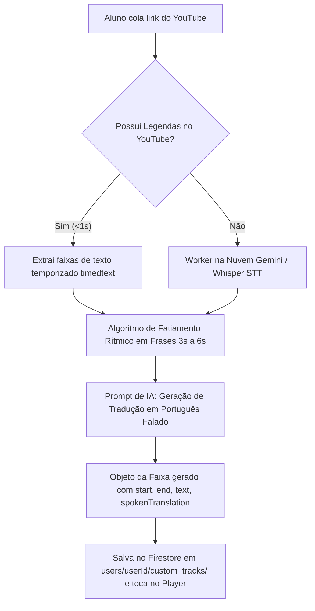

# 🏛️ Plano Mestre de Implementação: AgoraEuFalo SaaS & Player Pessoal Unificado

**Documento Institucional & Técnico de Arquitetura**  
**Projeto:** AgoraEuFalo (Professor Leonardo Leite)  
**Versão:** 3.0 (SaaS EdTech & Player Pessoal Unificado)  
**Data:** 2026-08-26  
**Status:** Aprovado para Execução  

---

## 🎯 1. Visão Estratégica & Modelo de Negócio SaaS

O ecossistema **AgoraEuFalo** evolui para uma plataforma **SaaS EdTech de Treino de Reflexo Oral**.  
Em vez de players isolados ou acessos fragmentados, **100% dos usuários cadastrados no ecossistema (Free, Cursos, Club ou Mentoria)** recebem o seu **Personal Training Player**, onde o acesso a conteúdos e limites é controlado pelo campo `tier` do aluno no Firestore.

```
┌─────────────────────────────────────────────────────────────────────────────────────────────┐
│                           FUNIL SAAS AGORAEUFALO (FREEMIUM ➔ PAGO)                          │
├─────────────────────────────────────────────────────────────────────────────────────────────┤
│  1. ENTRADA (Aluno Free):                                                                   │
│     • Cadastro gratuito em 1 clique via Google Auth ou Magic Link (cadastro.html).          │
│     • Recebe seu Personal Training Player exclusivo.                                        │
│     • Acesso total a todas as "Sugestões do Leo" + Aulas abertas de "Meus Cursos".          │
│                                                                                             │
│  2. O EFEITO "UAU" (Minhas Coisas - 1 Treino de Degustação):                                │
│     • O aluno cola qualquer link de música/vídeo do YouTube (ex: Pink Floyd).               │
│     • O motor híbrido extrai o áudio, transcreve em frases e gera a tradução falada.        │
│     • O aluno treina com karaokê e Play/Pause por toque no celular.                         │
│                                                                                             │
│  3. O PAYWALL NATURAL (Conversão para Assinatura Pro / Club / Mentoria):                    │
│     • Ao tentar cadastrar o 2º treino no YouTube ou abrir masterclasses fechadas:           │
│       ➔ "Você atingiu o limite do plano gratuito. Assine o Pro para treinos ilimitados 🚀"  │
│                                                                                             │
│  4. MENTORIA VIP INDIVIDUAL (Canal Fechado 1 a 1):                                          │
│     • Alunos promovidos a VIP recebem a aba exclusiva "Mentoria VIP" com prescrições        │
│       diretas e personalizadas do Professor Leo em áudio e vídeo.                           │
└─────────────────────────────────────────────────────────────────────────────────────────────┘
```

---

## 📱 2. Arquitetura das 4 Abas do Player Unificado

O player (`treino/player.html`) passa a operar com 4 pilares de conteúdo:

| Aba | Identificador | Visibilidade | Conteúdo & Mídia | Regra Aluno Free 🌱 | Regra Aluno Pago / VIP 👑 |
| :--- | :--- | :--- | :--- | :--- | :--- |
| **1. 👑 Mentoria VIP** | `tab-vip` | **Exclusiva** (`tier == 'vip'`) | Treinos individuais, aulas gravadas e prescrições 1 a 1 do Leo. Áudio + Vídeo. | *Invisível / Bloqueada* | **Acesso Total** ao canal privado do aluno (`students/{id}/tracks`). |
| **2. 💡 Sugestões do Leo** | `tab-suggestions` | **Pública** (Toda a base) | Pílulas de treino, connected speech, reflexos e músicas curadas pelo Leo. Áudio + Vídeo. | **Acesso Liberado** a todos os conteúdos publicados pelo Leo. | **Acesso Liberado** + Histórico e marcadores. |
| **3. 🎓 Meus Cursos** | `tab-courses` | **Membros** (Base logada) | Treinos enviados da Sala de Aula (`sala-de-aula.html`) + Treinos globais transmitidos pelo Leo. Áudio + Vídeo. | Apenas treinos de degustação postados pelo admin. | **Ilimitado**: Envia qualquer aula dos cursos matriculados. |
| **4. 🧪 Minhas Coisas** | `tab-my-stuff` | **Universal** (Base logada) | Músicas, entrevistas e vídeos do YouTube importados pelo próprio aluno com transcrição. Áudio + Vídeo. | **Limite de 1 treino ativo** (pode excluir e criar outro, ou assinar o Pro). | **Treinos ilimitados** na nuvem com background play e karaokê. |

---

## 👆 3. Novo Card de Karaokê Interativo (Play/Pause por Toque + Tradução Falada)

Eliminamos botões adicionais de loop para proporcionar uma experiência minimalista, tátil e focada no reflexo oral.

### 📐 Estrutura Visual do Card de Frase:
```
┌────────────────────────────────────────────────────────────────────────────────┐
│  ▶  "Good afternoon, everyone. My name is Estevao."                           │
│     (Boa tarde, pessoal! Meu nome é Estêvão.) ➔ Português Falado Real (Itálico)│
└────────────────────────────────────────────────────────────────────────────────┘
```

### 🎮 Mecânica de Interação por Toque:
1. **1º Toque na Janela da Frase:**
   - O áudio/vídeo salta imediatamente para o timestamp `sentence.start` e inicia a reprodução.
   - O card ganha destaque visual com borda dourada ativa (`border-amber-400 bg-amber-500/10`).
2. **2º Toque na Mesma Janela:**
   - Pausa a reprodução no mesmo milissegundo.
3. **Toque em Outra Janela:**
   - Pula instantaneamente para o início da nova frase e continua tocando.
4. **Benefício Pedagógico:** O aluno repete a mesma frase 10 vezes seguidas com o polegar de forma fluida, sem precisar procurar botões de loop.

---

## 🧠 4. Motor de Tradução para Português Falado Real (Zero Tradução Literal)

Toda frase sincronizada possui o campo `spokenTranslation` gerado por inteligência pedagógica do Professor Leonardo Leite.

### 📜 Diretriz Mestre da IA de Tradução:
> *"Você é o tradutor oficial do Professor Leonardo Leite (AgoraEuFalo). Traduza cada frase do inglês para o **PORTUGUÊS FALADO BRASILEIRO REAL**, natural, expressivo e coloquial, capturando o ritmo, a intenção comunicativa e as gírias do cotidiano. É terminantemente proibido fazer tradução literal de dicionário palavra por palavra."*

### 📌 Exemplos de Calibração:
- *"I'm down for that"* ➔ **"Tô super dentro!"** *(Jamais: "Estou para baixo disso")*
- *"Hold on a second"* ➔ **"Peraí um segundo"** *(Jamais: "Segure em um segundo")*
- *"Wish you were here"* ➔ **"Queria tanto que você estivesse aqui"** *(Jamais: "Desejo você estivesse aqui")*
- *"What are you up to?"* ➔ **"O que você tá aprontando?"** *(Jamais: "O que você está para cima de?")*
- *"It's up to you"* ➔ **"Você quem manda / Você decide"** *(Jamais: "Está até você")*

---

## 🔍 5. Motor Híbrido de Transcrição do YouTube (Minhas Coisas)

Quando o aluno cola um link do YouTube em **"Minhas Coisas"**:



---

## 🗄️ 6. Modelo de Dados no Google Cloud Firestore (Schema 1:1)

Seguindo a **Regra 11 do `AGENTS.md`** (Proibição absoluta de condensação e zero flattening):

### A. Coleção `users/{userId}` (Documento Central do Aluno):
```json
{
  "uid": "user_abc123",
  "email": "estevao@agoraeufalo.com.br",
  "name": "Estêvão",
  "tier": "vip",
  "menteeSlug": "estevao",
  "customTracksCount": 1,
  "enrolledProducts": ["projeto-aef-2026", "magic-stories-club"],
  "createdAt": "2026-08-26T10:00:00Z",
  "updatedAt": "2026-08-26T15:00:00Z"
}
```

### B. Coleção `suggestions/{trackId}` (Aba: Sugestões do Leo):
```json
{
  "id": "sug_01",
  "title": "Connected Speech no Cotidiano",
  "order": 1,
  "published": true,
  "audioUrl": "https://firebasestorage.googleapis.com/.../audio.mp3",
  "videoUrl": "https://www.youtube.com/watch?v=...",
  "coverImage": "assets/images/cover-sug-01.jpg",
  "duration": "03:45",
  "goldenTip": "Conecte consoantes finais com vogais iniciais.",
  "sentences": [
    {
      "id": 1,
      "start": 0.0,
      "end": 4.5,
      "text": "Hold on a second, let me check that for you.",
      "spokenTranslation": "Peraí um segundo, deixa eu dar uma olhada nisso pra você.",
      "notes": "Connected speech: /həʊld-ɒn/"
    }
  ]
}
```

### C. Subcoleção `users/{userId}/custom_tracks/{trackId}` (Aba: Minhas Coisas):
```json
{
  "id": "custom_1787762000",
  "title": "Wish You Were Here",
  "videoUrl": "https://www.youtube.com/watch?v=K6qj09DHvjw",
  "audioUrl": "https://firebasestorage.googleapis.com/.../audio.mp3",
  "coverImage": "https://img.youtube.com/vi/K6qj09DHvjw/hqdefault.jpg",
  "duration": "05:34",
  "sentences": [
    {
      "id": 1,
      "start": 18.5,
      "end": 23.2,
      "text": "So, so you think you can tell heaven from hell?",
      "spokenTranslation": "Então você acha mesmo que sabe diferenciar o paraíso do inferno?",
      "notes": ""
    }
  ]
}
```

### D. Subcoleção `users/{userId}/course_tracks/{trackId}` (Aba: Meus Cursos):
```json
{
  "id": "aef-01",
  "courseId": "projeto-aef-2026",
  "moduleId": "ciclo-01-fundamentos",
  "title": "Aula 01 • O Reflexo da Conexão Sonora",
  "audioUrl": "https://firebasestorage.googleapis.com/.../audio.mp3",
  "videoUrl": "https://firebasestorage.googleapis.com/.../video.mp4",
  "sentences": []
}
```

### E. Coleção `students/{menteeSlug}/tracks/{trackId}` (Aba: Mentoria VIP):
```json
{
  "id": "estevao-01",
  "title": "Session 01: UK International Keynote Presentation",
  "audioUrl": "https://firebasestorage.googleapis.com/.../Estevao_presentation_leo.mp3",
  "videoUrl": "",
  "duration": "16:29",
  "sentences": []
}
```

---

## 🔄 7. Fluxo de Promoção Automática para Mentorando VIP

A vinculação e promoção de qualquer aluno cadastrado ocorre em dois caminhos sem atrito:

1. **Promoção Manual via Admin (`admin.html`):**
   - Leo pesquisa o aluno na tabela CRM de alunos.
   - Altera o dropdown de `tier` para `👑 Mentoria VIP Individual` e define o `menteeSlug`.
   - O Firestore atualiza o documento em tempo real.
2. **Promoção Automática via Hotmart/Stripe Webhook:**
   - Aluno realiza a compra do produto Mentoria VIP.
   - O Webhook localiza o e-mail do aluno e altera `tier: "vip"` no Firestore.
3. **Reação Imediata do Player:**
   - Ao logar com seu e-mail, o Player detecta `tier: "vip"`, destrava a aba **👑 Mentoria VIP** e remove todas as travas de limites.

---

## 🗓️ 8. Cronograma de Execução em 5 Fases

```
┌─────────────────────────────────────────────────────────────────────────────────────────────┐
│                           FASES DE IMPLEMENTAÇÃO DO SAAS PLAYER                             │
├─────────────────────────────────────────────────────────────────────────────────────────────┤
│  FASE 1: Reestruturação Visual do Player para as 4 Abas                                     │
│  • Atualizar treino/player.html com as 4 abas responsivas.                                  │
│  • Conectar ao aefPortalAuth para leitura em tempo real do tier do aluno.                   │
│                                                                                             │
│  FASE 2: Novo Card de Frase com Play/Pause no Toque + Tradução Falada                       │
│  • Implementar a mecânica de toque (1º toque: play / 2º toque: pause).                      │
│  • Exibir a linha de tradução em português falado real com estilo visual de alto contraste. │
│  • Remover os botões obsoletos de loop.                                                     │
│                                                                                             │
│  FASE 3: Motor Híbrido de Transcrição do YouTube em "Minhas Coisas"                         │
│  • Desenvolver o extrator de legendas temporizadas do YouTube (timedtext).                  │
│  • Integrar o prompt de IA para tradução coloquial brasileira.                              │
│  • Implementar a trava de 1 treino para Free e ilimitado para Pro/VIP.                      │
│                                                                                             │
│  FASE 4: Suporte a Vídeo Dual (MP4 + YouTube) em Todas as Abas                              │
│  • Adaptar o player cinema do aplicativo para renderizar vídeo em qualquer aba.             │
│                                                                                             │
│  FASE 5: Gestão Administrativa no Command Center (admin.html)                               │
│  • Adicionar botão de alternância de Tier (Free ➔ VIP) no CRM de Alunos.                    │
│  • Adicionar painel de Publicar/Despublicar para as "Sugestões do Leo".                     │
│  • Build e Deploy final para produção.                                                      │
└─────────────────────────────────────────────────────────────────────────────────────────────┘
```

---

## 🛡️ 9. Conformidade com Regras Permanentes (`AGENTS.md` / `GEMINI.md`)

- **Regra 2 (Design Didático Claro):** Todas as janelas de frases de karaokê mantêm fundos claros de alto contraste com tipografia legível.
- **Regra 5 (Foco no Antigravity):** Sem abertura intrusiva de navegadores.
- **Regra 6 (TTS & Player Interativo):** MP3 puro 128kbps para áudio nativo, seek instantâneo e sincronização Firestore.
- **Regra 9 (Zero Mídia Pesada no Git):** Áudios e vídeos hospedados no Google Cloud Storage (`agoraeufalo-3463a.firebasestorage.app`).
- **Regra 11 (Zero Flattening):** Estrutura completa de coleções e subcoleções preservada sem achatamento.

---

